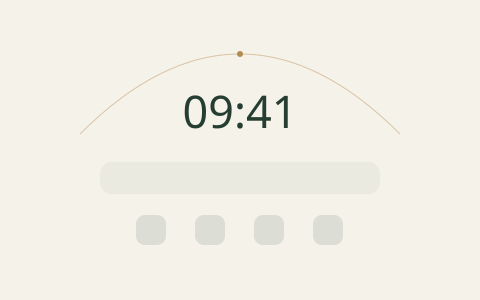
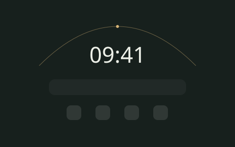

<p align="center"></p>
<h1 align="center">Vera</h1>
<p align="center">留一点空间，给今天。 · A little room for today.</p>

Vera 是原生 Chrome / Edge 新标签页扩展。1.1.13 用光影、时间与更清晰的内容层级重做默认桌面，将搜索和常用网站放在中心，同时保留全部主题、日常组件与自由布局。

<p align="center"></p>

上图为主题 SVG 设计预览，并非浏览器截图。当前版本的自动化结果和待完成的浏览器验收见 [验证记录](docs/daylight-validation.md)。仓库中的历史截图保留在 `screenshots/`，不代表 1.1.13 的界面。

## 功能

- 搜索：Google、Bing、DuckDuckGo、百度、GitHub；支持搜索建议与键盘选择，Ctrl / Cmd + K 聚焦。
- 常用网站：添加、编辑、删除、拖拽排序、自定义图标及 favicon。
- 日常组件：天气、待办、每日一言、番茄钟，各自独立开关。
- 小游戏已分离并禁用：原代码、素材和恢复说明保存在 `modules/minigames/`，已有存档保留。
- 主题：光影、山水、地球、月球、土星、像素；深色、浅色、跟随系统，像素主题保持专属深色模式。
- 自由桌面：拖拽、缩放、链接文件夹；通过滚动画布访问窗口外的内容，尺寸变化不改写位置。
- 中文、English、日本語；已有设置与内容保存在本地浏览器。

## 1.1.13 更新

新版玻璃叠层图标、柔和强调色与细线选框；移除时间弧线，恢复文字随机逐字浮出和组件动效，修复拖拽、缩放时重复播放开场动画的问题。

## 本地加载

在 Chrome 或 Edge 的扩展管理页打开开发者模式，选择“加载已解压的扩展程序”，选中项目目录。升级现有解压扩展时，在原扩展条目点击重新加载并打开新标签页，以保留同一扩展存储空间。

版本化安装包位于 `dist/vera-edge-1.1.13.zip`。先解压到固定目录，再加载该目录。本次改造不自动发布到商店。

## 开发与验证

开发工具需要 Node.js 22.17+ 和 Python 3.10+；扩展运行本身无需 Node、Python 或后端。

```bash
npm ci
npm run check
npm test
npm run package
npm run verify:package
```

`manifest.json` 是版本来源。修改版本后运行 `npm run sync:version` 同步 npm 元数据，再验证和打包。测试使用 jsdom 和隔离网络/Canvas 桩，不会请求真实天气、执行搜索或操作用户浏览器。

安装包只包含扩展运行文件、主题/字体资产、图标和语言包；不包含开发依赖、测试、缓存、CodeGraph、历史宣传素材或禁用的 VIP 文件。原有素材与根目录旧 ZIP 不会被覆盖。

- [设计与代码边界](docs/daylight-design.md)
- [自动化结果与浏览器验收状态](docs/daylight-validation.md)
- [隐私说明](PRIVACY.md)

## English

Vera is a native Chrome / Edge new tab extension centered on search and favorite websites. Daylight introduces a quiet visual identity, clearer typography, lighter shortcuts, and consistent controls across all six themes. Existing bookmarks, tasks, focus settings, wallpaper choices and free-layout coordinates are retained.

Mini-games are extracted into `modules/minigames` and disabled in 1.1.1; their implementation, assets and existing saves are preserved, but the extension does not load or package them. Celestial assets initialize when enabled. Search handles stale responses and keyboard navigation. The free desktop scrolls instead of rewriting saved positions. Settings, content and game progress remain local; network-backed features still use their existing providers.

Load this folder as an unpacked extension. Use Node.js 22.17+ for checks/tests and Python 3.10+ for deterministic packaging. See the validation record for the distinction between automated checks and pending browser screenshot verification.

## 日本語

Vera は検索とよく使うサイトを中心にした Chrome / Edge 向け新規タブ拡張です。落ち着いた配色と読みやすい文字でデスクトップを整えました。既存のテーマ、タスク、ポモドーロ、自由配置を引き続き利用できます。

ミニゲームはコードと素材を保存したまま分離・無効化しました。天体の素材は必要になったときに初期化され、バックグラウンドではアニメーションを停止します。自由デスクトップはスクロールに対応し、ウィンドウのサイズを変えても保存した位置を変更しません。

## License

MIT © Vera（既存 README の表記を維持）。同梱フォントおよび第三者アセットのライセンスは、それぞれのアセットフォルダを参照してください。
