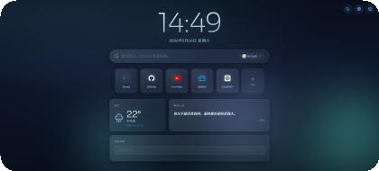
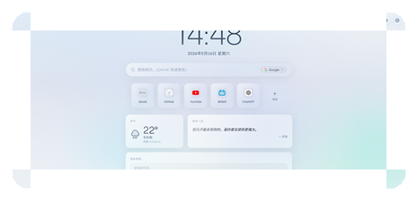

<p align="center">
  <b>中文</b> &nbsp;|&nbsp;
  <a href="README.md">English</a> &nbsp;|&nbsp;
  <a href="README_ja.md">日本語</a>
</p>

<p align="center">
  
</p>

<h1 align="center">Vera</h1>

<p align="center">Liquid Glass New Tab — 冰晶液态玻璃风格 Chrome/Edge 新标签页</p>

<p align="center">
  
  
</p>

---

## 预览

<p align="center">
  <a href="screenshots/dark.png" target="_blank">
    
  </a>
  <a href="screenshots/light.png" target="_blank">
    
  </a>
</p>

<p align="center" style="color: #8a9db5; font-size: 13px; margin-top: 4px;">
  深色模式 &nbsp;·&nbsp; 浅色模式 &nbsp;·&nbsp; 点击查看原图
</p>

---

## 功能

- **时钟与日期** — 大号液晶感时钟，日期随语言格式化
- **多引擎搜索** — Google / Bing / DuckDuckGo / 百度 / GitHub
- **快捷链接** — 拖拽排序，自动拉取网站 favicon，支持自定义 SVG 图标
- **天气组件** — wttr.in + Open-Meteo 双 API，Permissions API 监听权限变化
- **待办事项** — 本地存储，点击完成/删除
- **每日名言** — 中文古诗词 / 英文经典 / 日本谚语，随语言切换
- **三语言界面** — 中文 / English / 日本語，首次自动跟随系统语言
- **深色/浅色/跟随系统** — 启动即生效无闪烁
- **高自定义设置面板**
  - 玻璃透明度 / 模糊强度 / 圆角大小
  - 强调色 + 5 套背景预设 + 自定义背景图
  - 动态背景开关
  - 所有组件独立显隐

## 安装

1. 下载或克隆本仓库
   ```bash
   git clone https://github.com/doiiaioiiiailphin-cmyk/vera-new-tab.git
   ```
2. 打开 Chrome/Edge，地址栏输入 `chrome://extensions/`
3. 开启右上角 **"开发者模式"**
4. 点击 **"加载已解压的扩展程序"**
5. 选择项目文件夹，完成

## 项目结构

```
vera-new-tab/
├── manifest.json        # 扩展清单 (Manifest V3)
├── index.html           # 新标签页主文件
├── i18n.js              # 多语言翻译
├── script.js            # 核心逻辑
├── style.css            # UI 样式
├── preload.js           # 防闪烁主题初始化
├── icons/               # 扩展图标
├── screenshots/         # 预览截图
└── .gitignore
```

## 技术栈

纯前端 — HTML + CSS + JavaScript，零依赖。

- CSS `backdrop-filter` 毛玻璃效果
- CSS 自定义属性全主题化
- SVG Sprite 图标系统（34+ 矢量符号）
- `localStorage` 持久化所有设置
- wttr.in + Open-Meteo 天气 API
- Permissions API 监听地理位置授权
- Google Fonts（Sora + Lexend + Noto Sans SC/JP）

## License

MIT © Vera
